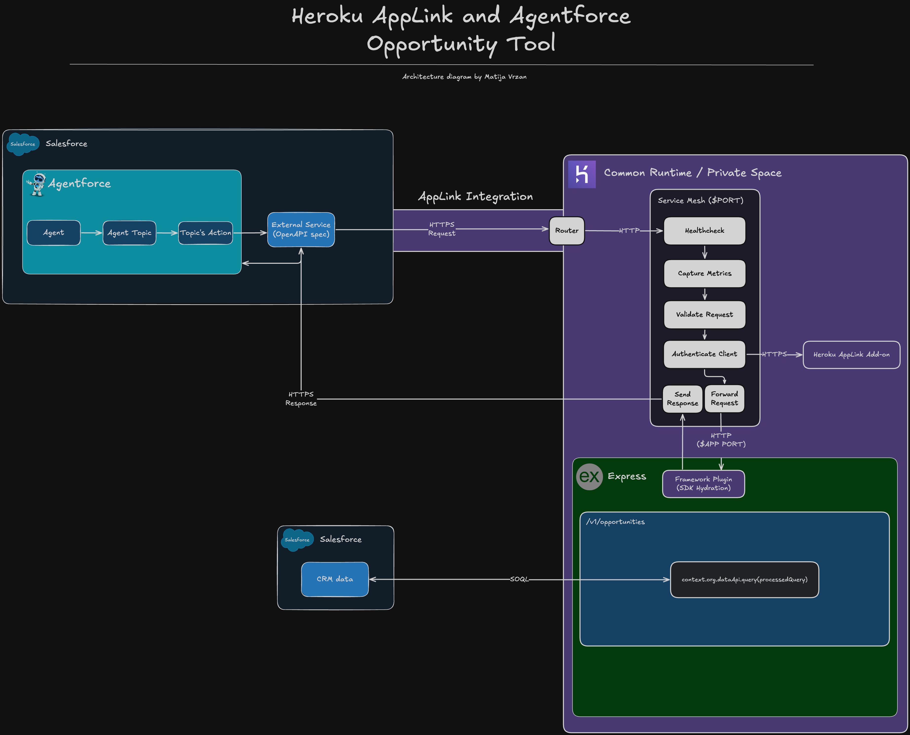

<p align="center">
<a  href="https://www.salesforce.com/agentforce/"></a>
<a  href="https://www.heroku.com/"></a>
<a href="https://expressjs.com/"></a>
<p/>

# Agentforce Opportunity Tool

Learn how you can leverage Heroku AppLink with a Node.js Express server to build an Agentforce tool. This tool will allow you to use natural language to get insights into Salesforce opportunities.

# Table of Contents

- [Agentforce Opportunity Tool](#agentforce-opportunity-tool)
- [Table of Contents](#table-of-contents)
  - [What does it do?](#what-does-it-do)
  - [How does it work?](#how-does-it-work)
  - [API Specification](#api-specification)
  - [Project Structure](#project-structure)
    - [Architecture diagram](#architecture-diagram)
  - [Technologies used](#technologies-used)
- [Configuration](#configuration)
  - [Requirements](#requirements)
  - [Setup](#setup)
    - [Local environment configuration](#local-environment-configuration)
  - [Deployment](#deployment)
- [License](#license)
- [Disclaimer](#disclaimer)

---

## What does it do?

This project demonstrates how to leverage [Heroku AppLink](https://devcenter.heroku.com/articles/heroku-applink) to build fast and reliable tools for Agentforce. Specifically, how a Node.js Express application enables Agentforce with natural language processing of Salesforce CRM opportunities.

The tool accepts SOQL (Salesforce Object Query Language) statements and executes them against your Salesforce org to retrieve opportunity data. It intelligently handles user ID placeholders and returns both detailed opportunity records and mathematical calculations.

## How does it work?

1. **Natural Language Input**: Users interact with Agentforce using natural language to ask about opportunities
2. **SOQL Generation**: An LLM generates appropriate SOQL queries based on the user's intent
3. **Query Processing**: The Express server receives the SOQL query and processes user ID placeholders
4. **Salesforce Integration**: The server uses Heroku AppLink to securely execute queries against Salesforce
5. **Response Handling**: Results are returned as structured JSON with support for both data records and mathematical calculations

## API Specification

The API provides a single endpoint for querying Salesforce opportunities:

**Endpoint**: `POST /v1/opportunities`

**Request Body**:

```json
{
  "query": "SELECT Id, Name, Amount FROM Opportunity WHERE OwnerId = 'USER_ID'"
}
```

**Response**:

```json
{
  "message": "success",
  "opportunities": [
    {
      "Id": "006Ka00000TJEZUIA5",
      "Name": "Omega Technologies",
      "StageName": "Closed Won",
      "Amount": 65500,
      "CloseDate": "2025-09-10",
      "AccountId": "001Ka00004PqZCIIA3",
      "OwnerId": "005Ka000004UsT0IAK",
      "Probability": 100,
      "Description": "This deal is looking good so far."
    }
  ],
  "mathResult": ""
}
```

## Project Structure

```
├── api-spec.yaml              # OpenAPI 3.0 specification
├── package.json              # Root package configuration
├── README.md                 # Project documentation
├── screenshots/              # Logo and visual assets
├── server/                   # Express server code
│   ├── index.js             # Main server file
│   ├── package.json         # Server dependencies
│   └── src/
│       ├── controllers/
│       │   └── opportunitiesHandler.js  # Main query handler
│       ├── middleware/
│       │   └── heroku-service-mesh.js   # Salesforce integration
│       ├── routes/
│       │   └── salesforce-routes.js     # API routes
│       └── utils/
│           └── loggingUtil.js           # Logging utilities
```

### Architecture diagram



## Technologies used

- [Node.js](https://nodejs.org/en)
- [Express](https://expressjs.com/)
- [JavaScript](https://developer.mozilla.org/en-US/docs/Web/JavaScript)
- [Heroku](https://www.heroku.com/)
- [Heroku AppLink](https://devcenter.heroku.com/articles/getting-started-heroku-applink-agentforce?singlepage=true)

For a more detailed overview of the development & production dependencies, please check [`package.json`](./server/package.json).

# Configuration

## Requirements

To run this application locally, you will need the following:

- An active Salesforce account with Data Cloud
- Node.js version 20 or later installed (type `node -v` in your terminal to check). Follow [instructions](https://nodejs.org/en/download) if you don't have node installed
- npm version 10.0.0 or later installed (type `npm -v` in your terminal to check). Node.js includes `npm`
- git installed. Follow the instructions to [install git](https://git-scm.com/downloads)
- A [Heroku account](https://signup.heroku.com/)

## Setup

### Local environment configuration

The first step is to clone the repository and install the project dependencies via a terminal interface by running the `npm install` in the `server` folder:

```
cd salesforce-agentforce-opportunity-tool/server
npm install
```

The second step is to create a `.env` file in the `server` folder. Find the `.env.example` file, copy it and rename it to `.env`.

```
cd salesforce-agentforce-opportunity-tool/server
cp .env.example .env
```

Edit the newly created `.env` files and update the variables with your account specific information.

```
# Heroku integration details
HEROKU_INTEGRATION_API_URL=
HEROKU_INTEGRATION_TOKEN=
```

Start the development server

```
npm run dev
```

In order to get the appropriate `.env` variables for local development and to make the Heroku AppLink integration actually work, please follow the [setup guide](https://devcenter.heroku.com/articles/getting-started-heroku-applink-agentforce?singlepage=true).

Once all of this is done, your server will be available at http://localhost:3000

## Deployment

Once you are happy with your application, you can deploy it to Heroku!

To deploy the application to Heroku, please follow the [official instructions](https://devcenter.heroku.com/articles/git).

# License

[MIT](http://www.opensource.org/licenses/mit-license.html)

# Disclaimer

This software is to be considered "sample code", a Type B Deliverable, and is delivered "as-is" to the user. Salesforce bears no responsibility to support the use or implementation of this software.
